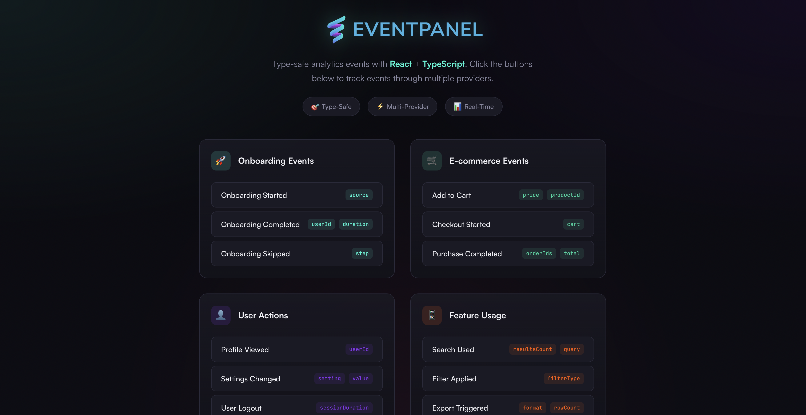

# EventPanel Web Demo

Type-safe analytics events example using [EventPanel](https://eventpanel.net).

> 🚀 **[View Live Demo](https://eventpanel.github.io/eventpanel-web-demo/)** — Try it in your browser!



## Project Structure

```
├── backend/          # NestJS API server
│   └── src/
│       ├── main.ts
│       └── app.controller.ts
├── frontend/         # React + Vite + TypeScript
│   └── src/
│       ├── analytics/
│       │   ├── events.ts        # Generated by EventPanel
│       │   ├── AnalyticsService.ts
│       │   ├── providers/
│       │   └── hooks/
│       └── components/
└── EventPanel.yaml   # EventPanel schema
```

## Quick Start

```bash
# Install dependencies
npm install
cd frontend && npm install && cd ..

# Development (run in separate terminals)
npm run start:dev    # Backend on :3005
npm run dev          # Frontend on :5173

# Production build
npm run build
npm start
```

## Scripts

| Command | Description |
|---------|-------------|
| `npm run dev` | Start frontend dev server (port 5173) |
| `npm run start:dev` | Start backend in watch mode (port 3005) |
| `npm run build` | Build both frontend and backend |
| `npm start` | Run production server |

## Usage

```typescript
import { AnalyticsEvents, useAnalytics } from './analytics';

function MyComponent() {
  const { track } = useAnalytics();

  const handleClick = () => {
    track(AnalyticsEvents.OnboardingEvents.onboardingStarted(Source.Organic));
  };

  return <button onClick={handleClick}>Start</button>;
}
```

## License

MIT
